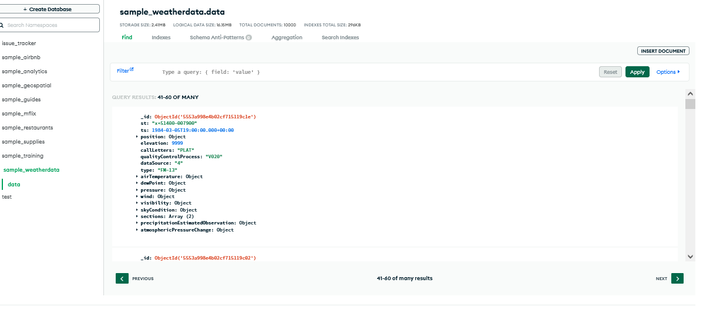

# Nestec

This is an agriculture app whose name was derived from
my name and technology

# Stack
### Backend Dependencies:
1. **Express**: For building the RESTful API and handling
HTTP requests
2. **Mongoose**: For interacting with MongoDB database
3. **dotenv**: For loading environment variables from the
`.env` file
4. **bcrypt**: For hashing passwords
5. **jsonwebtoken**: For generating and verifying JSON Web
Tokens for authentication
6. **Redis-CLI**: for the cache database server
7. **Node.js**: Server

#### to be added at a later stage
7. **twilio**: Python library for Twilio API

<br></br>
### Frontend Dependencies:
1. **react-router-dom**: For client-side routing
2. **axios**: For making HTTP requests to the backend API
4. **Bootstrap**: For styling and UI components
6. **Node.js**: API

# Example of Development Procedure Followed
### Backend Dependencies:
1. Navigate to the `backend` directory:
   ```
   mkdir backend && cd backend
   ```

2. Initialize npm (if not already initialized):
   ```
   npm init -y
   ```

3. Install required dependencies:
   ```
   npm install express mongoose dotenv bcrypt jsonwebtoken
   ```

<br></br>
### Frontend Dependencies:
1. Navigate to the `<repo root>` directory:
   ```
   cd ../<repo root>
   ```

3. Initialize npm:
   ```
   npm init -y
   ```

4. Install required dependencies:
   ```
   npm install axios
   ```

<br></br>

## Installation

To install and run Nestec on your local machine, follow
these steps:

1. Clone this repository to your local machine.
   ```
   git clone https://github.com/bshongwe/Nestec_farm-app.git
   ```

2. Navigate to the project directory.
   ```
   cd Nestec_farm-app
   ```

3. Install dependencies for the frontend and backend.
   ```
   cd /<repo root>
   npm install
   cd ../node-redis-mongodb-backend
   npm install
   ```

4. Ensure you have MongoDB and Redis installed and running
on your machine. Make sure to note down the MongoDB and
Redis ports.

5. Create a `.env` file in the `cache-aside pattern server`
directory and provide the necessary environment variables.
   ```
   MONGODB_URI=mongodb://localhost:<mongo_port>/nestec
   REDIS_URI=redis://localhost:<redis_port>
   PORT=<node_port>
   ```

   Replace `<mongo_port>`, `<redis_port>`, and
   `<node_port>` with the respective ports for MongoDB,
   Redis and Node server.

6. To start the servers

#### NodeJS Server
   ```
   cd ../<repo root>
   npm start
   ```
   or
   ```
   node server.js
   ```
   <strong>N. B.:</strong> the front end static files are
   automatically served into the backend server when the
   Node server runs. <i>Check the API routes. Adjust with
   caution.</i>

<br></br>
#### Cache-aside Server
   ```
   cd ../node-redis-mongodb-backend
   npm start
   ```

8. Access the application in browser using the following
ports at:<br>
-   frontend: `http://localhost:3000`
-   backendend (<i>to run the backend servers</i>:
    -   MongoDB: `http://localhost:3030`
    -   Redis: `http://localhost:11136`

```
Make sure to replace `<mongo_port>`, `<redis_port>`, and
`<node_port>` with the actual ports you're using for
MongoDB, Redis, and your Node server respectively.
```

# Screen Shots of App
## Features
<div align="center">
  <br />
    <a href="https://youtu.be/3jwDbdasbdM?si=MPgDvs8U4NqRw5vs" target="_blank">
      
    </a>
  <br />
</div>
## Market News
<div align="center">
  <br />
    <a href="https://youtu.be/3jwDbdasbdM?si=MPgDvs8U4NqRw5vs" target="_blank">
      
    </a>
  <br />
</div>
## Weather API
<i>(MongoDB Data test)</i>
<div align="center">
  <br />
    <a href="https://youtu.be/3jwDbdasbdM?si=MPgDvs8U4NqRw5vs" target="_blank">
      
    </a>
  <br />
</div>
## Data Storage Model
<div align="center">
  <br />
    <a href="https://youtu.be/3jwDbdasbdM?si=MPgDvs8U4NqRw5vs" target="_blank">
      
    </a>
  <br />
</div>
## Nestec web infrastructure
<div align="center">
  <br />
    <a href="https://youtu.be/3jwDbdasbdM?si=MPgDvs8U4NqRw5vs" target="_blank">
      
    </a>
  <br />
</div>